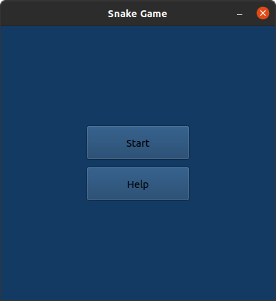
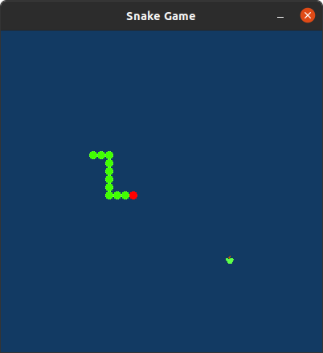
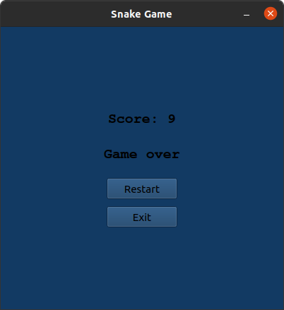

Snake Game
==========
A simple implemantation of the well-known Snake game.

This project is based on *Qt5 framework*. You must have *Qt5 installed on you system*. In addition you must install *qtmultimedia* for the sound effects.

Screenshots
===========
 <div align="center">
    
    
    
</div>

How to play?
===========
- On *Ubuntu 20.04*: Assuming that you have cloned this repository and you are inside the folder that contains the project, open a terminal:

``` sh
qmake
make
./Snake
```
- Further instruction of the controls can be found when starting the game and press the *Help* button on the Start Screen (see screenshots above).

Dependencies
============
- *Qt5 framework*. You must have it installed on you system. For example, on *Ubuntu 20.04*:

``` sh
sudo apt install qt5-default
```

- *qtmultimedia*. For example, on *Ubuntu 20.04*:
``` sh
sudo apt-get install qtmultimedia5-dev
```
